# AZ-500 Enterprise Implementation Runbook

# Lab 01: Secure Networking Using Network Security Groups (NSGs) and Application Security Groups (ASGs)

*Author:* Isioma Napoleon Peter

*Certification:* Microsoft Certified: Azure Security Engineer Associate (AZ-500)

*Cloud Platform:* Microsoft Azure

*Region:* East US

---

# Document Control

| Item | Value |
|------|-------|
| Document Type | Enterprise Implementation Runbook |
| Audience | Cloud Engineers, Security Engineers, Students |
| Objective | Deploy and secure a two-tier Azure environment using Network Security Groups (NSGs) and Application Security Groups (ASGs) |
| Lab Status | Completed |

---

# Executive Summary

This document provides a complete implementation guide for deploying a secure two-tier Microsoft Azure environment using Virtual Networks, Network Security Groups (NSGs), Application Security Groups (ASGs), and Virtual Machines.

The deployment demonstrates secure network segmentation, workload isolation, and controlled communication between the application tier and the database tier using Microsoft Azure security best practices.

---

# Business Scenario

An organisation is deploying a web application consisting of a public web server and a private database server.

To secure the environment:

- Internet users must access only the web server.
- The database server must never be exposed directly to the Internet.
- SQL traffic must be allowed only from the web server.
- Firewall rules should reference workloads instead of IP addresses whenever possible.

---

# Solution Architecture

                     Internet
                         │
                 HTTP (80) / HTTPS (443)
                         │
                  nsg-frontend
                         │
                 FrontendSubnet
                  10.0.2.0/24
                         │
                     VM-WEB
                  App-SGs-Web
                         │
                     TCP 1433
                         │
                  nsg-backend
                         │
                 BackendSubnet
                  10.0.3.0/24
                         │
                     VM-DB
                  App-SGs-DB

---

# 1. Create the Resource Group

## Objective

Create a logical container that will contain every Azure resource used throughout this deployment.

### Navigation

Azure Portal

→ Resource Groups

→ Create

### Configuration

| Setting | Value |
|---------|-------|
| Resource Group | rg-secure-networking |
| Region | East US |

Click *Review + Create*.

Click *Create*.

Wait until Azure reports that the deployment completed successfully.

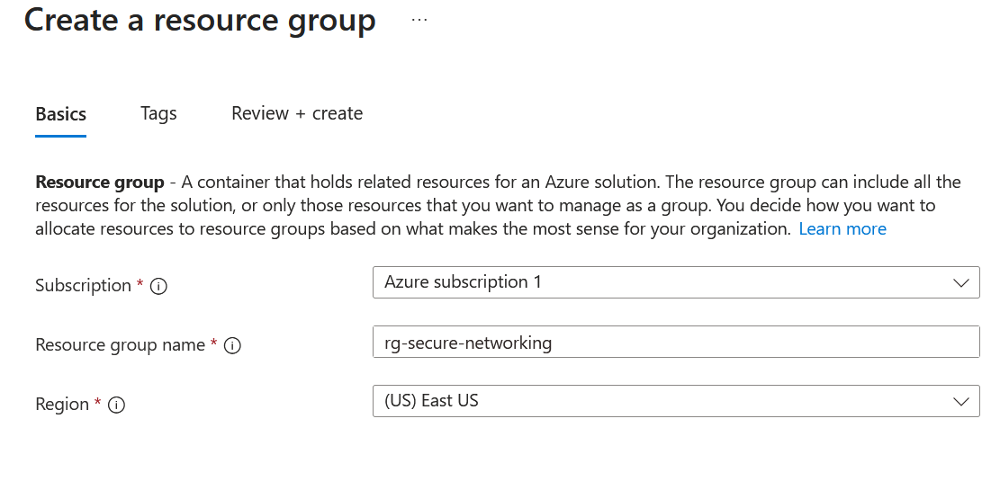

### Validation

Verify that:

- Resource Group = *rg-secure-networking*
- Provisioning State = *Succeeded*

---

# 2. Create the Virtual Network

## Objective

Create the Azure Virtual Network that will host both application tiers.

### Navigation

Azure Portal

→ Resource Groups

→ rg-secure-networking

→ Create

→ Virtual Network

### Configuration

| Setting | Value |
|---------|-------|
| Name | secure-network-vnet |
| Region | East US |
| Address Space | 10.0.0.0/16 |

Create the following subnets:

| Subnet | Address Range |
|---------|---------------|
| FrontendSubnet | 10.0.2.0/24 |
| BackendSubnet | 10.0.3.0/24 |

Click *Review + Create*.

Click *Create*.

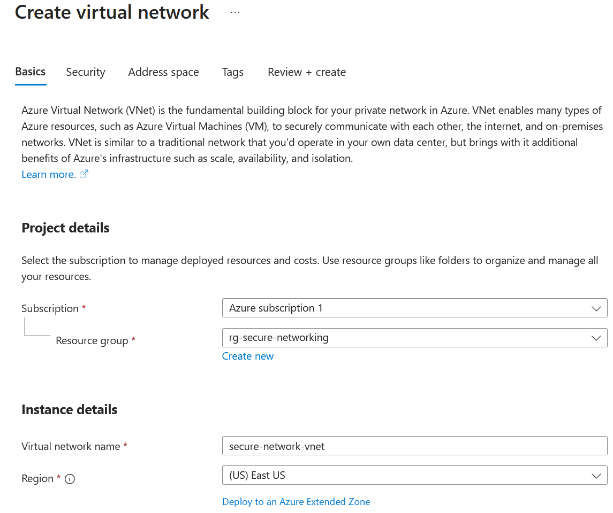

### Screenshot

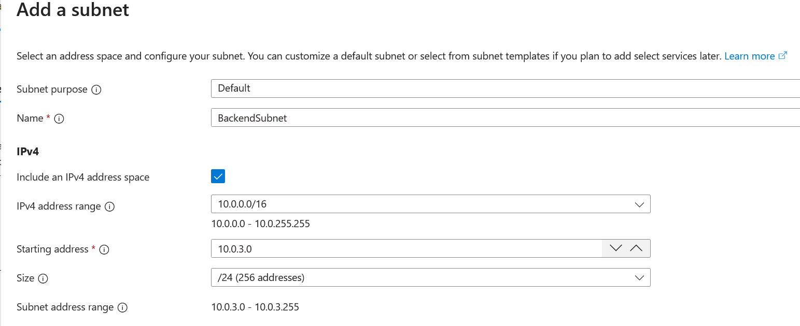

### Validation

Verify:

- secure-network-vnet exists.
- FrontendSubnet exists.
- BackendSubnet exists.

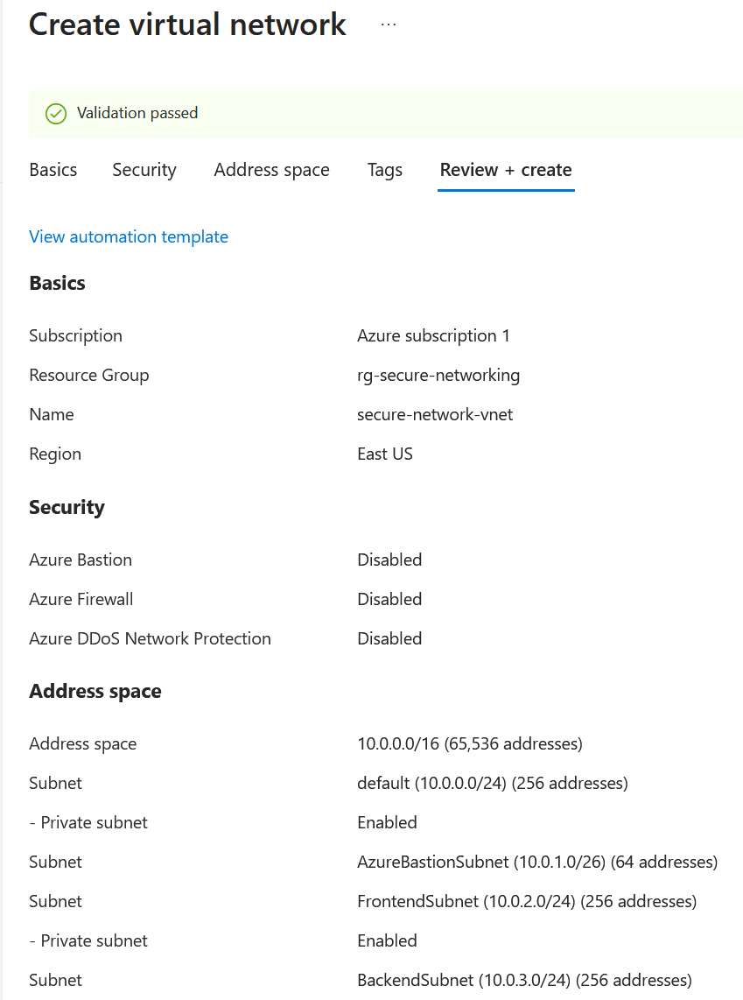

# 3. Create the Web Application Security Group

## Objective

Create an Application Security Group (ASG) to logically group all web-tier virtual machines. This enables Network Security Group (NSG) rules to reference application workloads instead of individual IP addresses.

### Navigation

Azure Portal

→ Resource Groups

→ rg-secure-networking

→ Create

→ Application Security Group

### Configuration

| Setting | Value |
|---------|-------|
| Name | App-SGs-Web |
| Region | East US |

Click *Review + Create*.

Click *Create*.

Wait until Azure reports that the deployment completed successfully.

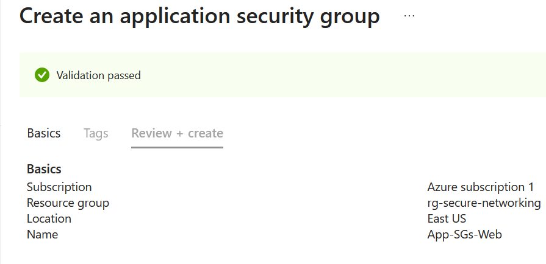

### Validation

Verify:

- Application Security Group = *App-SGs-Web*
- Provisioning State = *Succeeded*

---

# 4. Create the Database Application Security Group

## Objective

Create an Application Security Group for the backend database tier.

### Navigation

Azure Portal

→ Resource Groups

→ rg-secure-networking

→ Create

→ Application Security Group

### Configuration

| Setting | Value |
|---------|-------|
| Name | App-SGs-DB |
| Region | East US |

Click *Review + Create*.

Click *Create*.

### Validation

Verify:

- Application Security Group = *App-SGs-DB*
- Provisioning State = *Succeeded*

---

# 5. Create the Frontend Network Security Group

## Objective

Create a Network Security Group that will secure the FrontendSubnet.

### Navigation

Azure Portal

→ Resource Groups

→ rg-secure-networking

→ Create

→ Network Security Group

### Configuration

| Setting | Value |
|---------|-------|
| Name | nsg-frontend |
| Region | East US |

Click *Review + Create*.

Click *Create*.

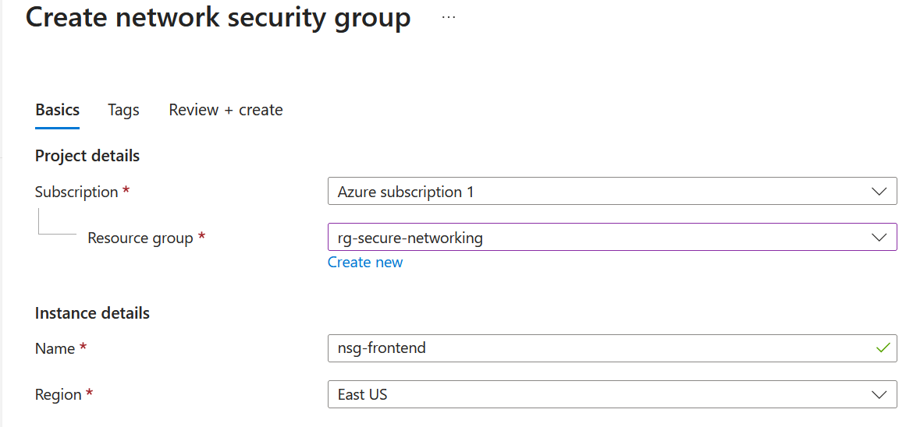

### Validation

Verify:

- Network Security Group = *nsg-frontend*
- Provisioning State = *Succeeded*

# 6. Configure the HTTP Inbound Security Rule

## Objective

Allow Internet users to access the web application over HTTP (TCP port 80).

This rule applies only to virtual machines that belong to the *App-SGs-Web* Application Security Group.

### Navigation

Azure Portal

→ Resource Groups

→ rg-secure-networking

→ nsg-frontend

→ Inbound security rules

→ Add

### Configuration

| Setting | Value |
|---------|-------|
| Source | Any |
| Destination | Application Security Group |
| Destination ASG | App-SGs-Web |
| Service | HTTP |
| Protocol | TCP |
| Port | 80 |
| Action | Allow |
| Priority | 100 |
| Rule Name | Allow-HTTP-To-Web |

Click *Add*.

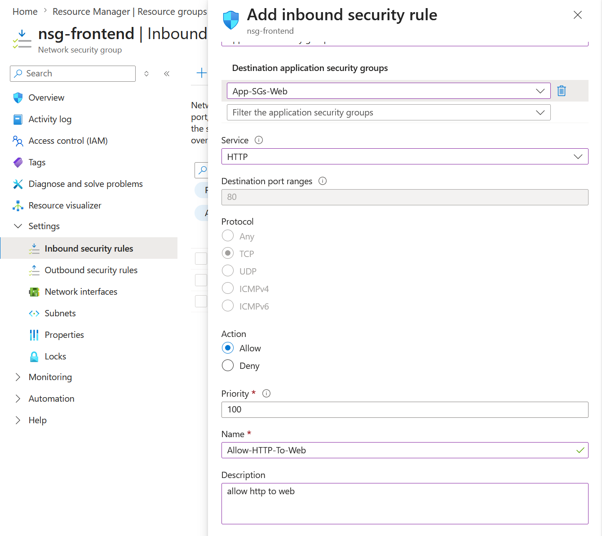

### Validation

Verify:

- Rule Name = *Allow-HTTP-To-Web*
- Destination = *App-SGs-Web*
- Protocol = *TCP*
- Port = *80*
- Priority = *100*

---

# 7. Configure the SQL Security Rule

## Objective

Allow Microsoft SQL Server traffic (TCP port 1433) from the web application to the database server.

The database server must never accept SQL traffic directly from the Internet.

### Navigation

Azure Portal

→ Resource Groups

→ rg-secure-networking

→ nsg-backend

→ Inbound security rules

→ Add

### Configuration

| Setting | Value |
|---------|-------|
| Source | Application Security Group |
| Source ASG | App-SGs-Web |
| Destination | Application Security Group |
| Destination ASG | App-SGs-DB |
| Service | MS SQL |
| Protocol | TCP |
| Destination Port | 1433 |
| Action | Allow |
| Priority | 100 |
| Rule Name | Allow-SQL-From-Web |

Click *Add*.

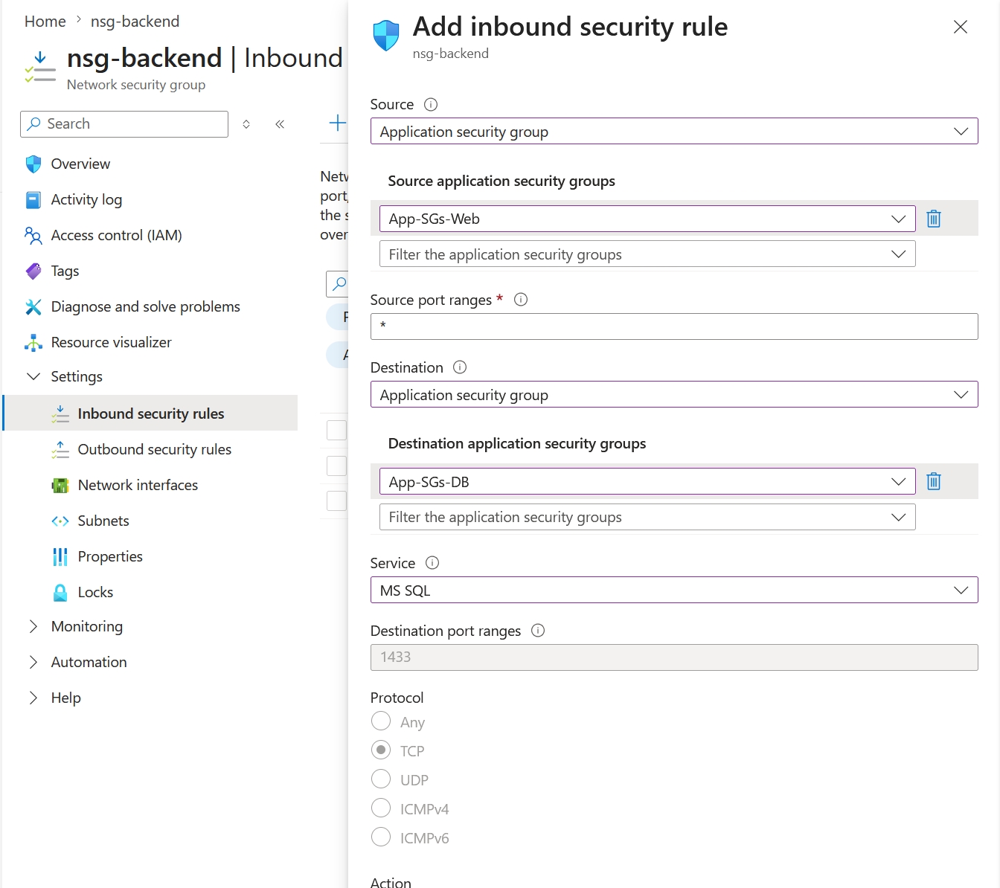

### Validation

Verify:

- Source = *App-SGs-Web*
- Destination = *App-SGs-DB*
- Protocol = *TCP*
- Port = *1433*
- Action = *Allow*

---

# 8. Associate the Backend Network Security Group

## Objective

Associate *nsg-backend* with *BackendSubnet* so that every virtual machine deployed within the subnet automatically inherits the configured security policies.

### Navigation

Azure Portal

→ Resource Groups

→ rg-secure-networking

→ nsg-backend

→ Subnets

→ Associate

### Configuration

| Setting | Value |
|---------|-------|
| Virtual Network | secure-network-vnet |
| Subnet | BackendSubnet |

Click *Save*.

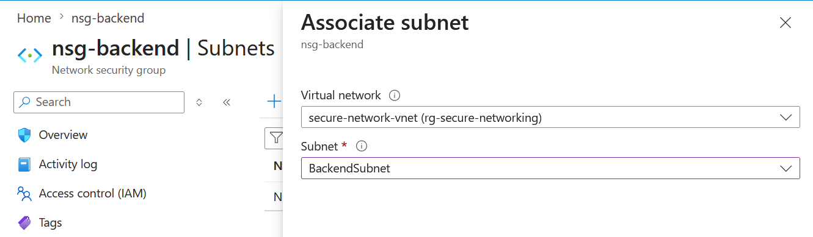

### Validation

Verify:

- Virtual Network = *secure-network-vnet*
- Associated Subnet = *BackendSubnet*

- # 9. Deploy the Web Server Virtual Machine (VM-WEB)

## Objective

Deploy the frontend virtual machine that will host the web application. The virtual machine will reside in the FrontendSubnet, receive a public IP address for Internet access, and be associated with the App-SGs-Web Application Security Group.

### Navigation

Azure Portal

→ Resource Groups

→ rg-secure-networking

→ Create

→ Virtual Machine

### Configuration

| Setting | Value |
|---------|-------|
| Virtual Machine Name | VM-WEB |
| Region | East US |
| Image | Windows Server 2022 Datacenter: Azure Edition |
| Size | Standard_B2s (or lab equivalent) |
| Virtual Network | secure-network-vnet |
| Subnet | FrontendSubnet |
| Public IP | Enabled |
| Application Security Group | App-SGs-Web |

Click *Review + Create*.

Click *Create*.

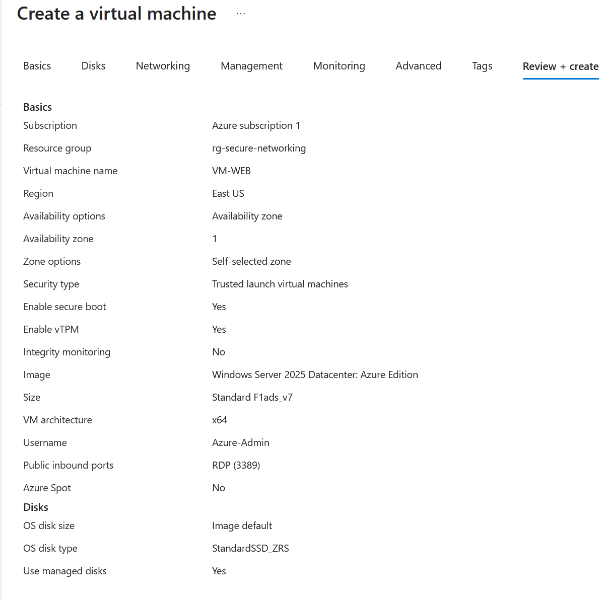

### Validation

Verify:

- VM-WEB deployment completed successfully.
- The VM is connected to *FrontendSubnet*.
- The VM is a member of *App-SGs-Web*.
- A public IP address has been assigned.

---

# 10. Deploy the Database Virtual Machine (VM-DB)

## Objective

Deploy the backend database virtual machine. This VM will remain private and will only accept SQL traffic from VM-WEB through the configured Application Security Groups and Network Security Groups.

### Navigation

Azure Portal

→ Resource Groups

→ rg-secure-networking

→ Create

→ Virtual Machine

### Configuration

| Setting | Value |
|---------|-------|
| Virtual Machine Name | VM-DB |
| Region | East US |
| Image | Windows Server 2022 Datacenter: Azure Edition |
| Size | Standard_B2s (or lab equivalent) |
| Virtual Network | secure-network-vnet |
| Subnet | BackendSubnet |
| Public IP | Disabled |
| Application Security Group | App-SGs-DB |

Click *Review + Create*.

Click *Create*.

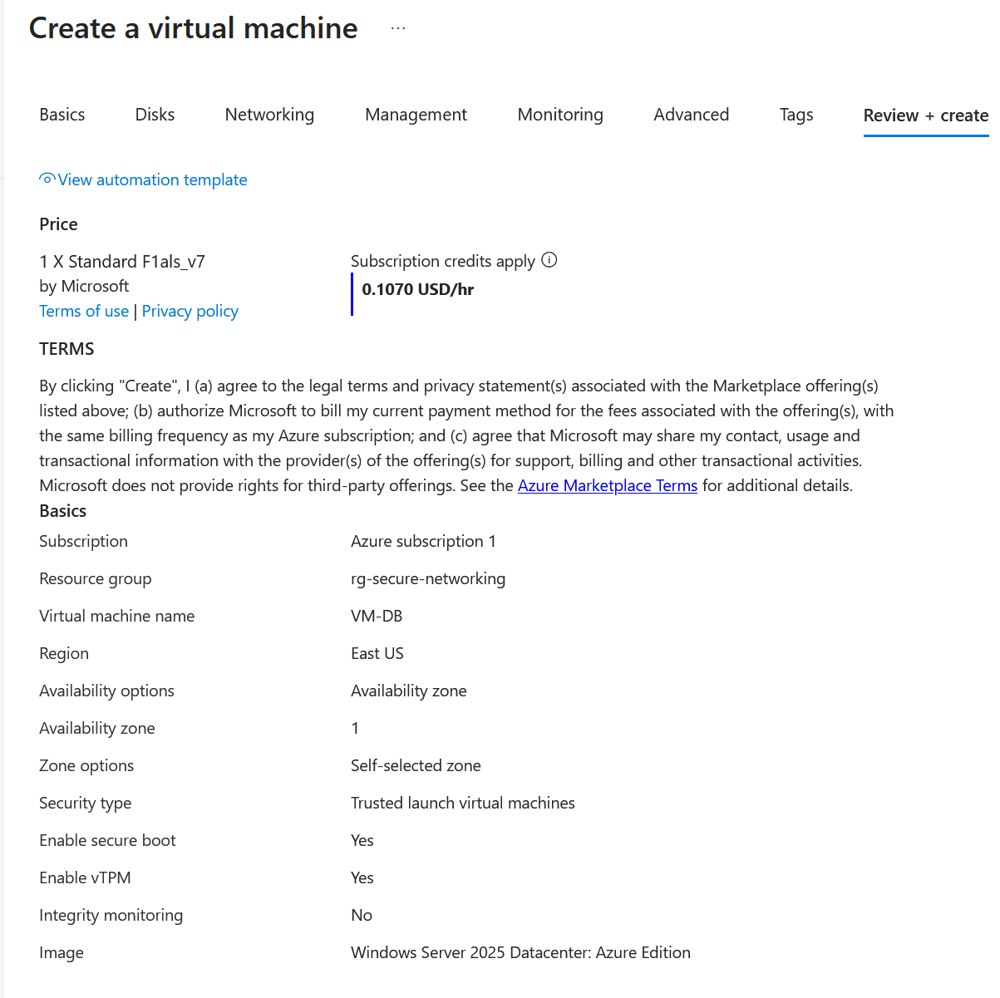

### Validation

Verify:

- VM-DB deployment completed successfully.
- The VM is connected to *BackendSubnet*.
- The VM is a member of *App-SGs-DB*.
- No public IP address is assigned.

---

# Security Validation

After completing the deployment, validate the following:

- VM-WEB is reachable through HTTP (TCP port 80).
- VM-DB does not have a public IP address.
- SQL traffic (TCP port 1433) is allowed only from *App-SGs-Web* to *App-SGs-DB*.
- Internet traffic cannot directly access VM-DB.
- Frontend and backend workloads are segmented using separate subnets.

---

# Enterprise Security Best Practices Demonstrated

This implementation demonstrates several Azure security best practices:

- Network segmentation using dedicated frontend and backend subnets.
- Workload-based filtering with Application Security Groups.
- Least privilege access through tightly scoped NSG rules.
- Isolation of backend resources from direct Internet access.
- Layered network security using Virtual Networks, NSGs, and ASGs.
- Secure communication between application and database tiers.

---

# Conclusion

This lab successfully implemented a secure two-tier Azure environment using Azure networking and security services. By combining Virtual Networks, Network Security Groups, Application Security Groups, and carefully configured security rules, the deployment protects backend resources while allowing controlled access to the web application.

The design reflects enterprise cloud

